## Technologies Implemented:
- ASP.NET Core 2.2 (with .NET Core 2.2)
- ASP.NET MVC Core 2.2
- ASP.NET WebApi Core 2.2
- ASP.NET Identity Core 2.2
- Entity Framework Core 2.2
- .NET Core Native DI
- AutoMapper
- FluentValidator
- MediatR
- Swagger UI

## Architecture:
- Full architecture with responsibility separation concerns, SOLID and Clean Code
- Domain Model Pattern, CQRS and ES concepts
- Domain Driven Design (Layers and Domain Model Pattern)
- Domain Events
- Domain Notification
- CQRS - Command Query Responsibility Segregation
- Event Sourcing
- Unit of Work
- Repository and Generic Repository
- ASP.NET Identity working throught WebAPI services
- Different ways to read and write data
- Unit Tests
- Integration Tests

## Used Software
* Microsft Windows 10 Pro
* Microsoft Visual Studio Professional 2019 (versão 16.0.2)
* Docker Desktop Community Version 2.0.0.3 (31259) - Channel: stable - Build: 8858db3
* Microsoft SQL Server 2017 (RTM-CU13) (KB4466404) - 14.0.3048.4 (X64) Developer Edition 
* SQL Server Management Studio v17.4

## Sobre o Desafio:
O desafio proposto pela Stone Payments pode ser acessado aqui -> https://github.com/stone-payments/microtef-hire-me

Basicamente o desafio consiste na implementação de um sistema que simule o processo de uma transação financeira.

Para simular um sistema de transação financeira foi implementado:
1. **Cliente WPF**
2. **Servidor de comunicações**

## Sobre as Regras de Negócio do Desafio Proposto pela Stone
1. **Cliente WPF (AmonRa)**
	
	* Deve haver 4 telas principais:
		* **Tela de transação**: input dos dados da transação e envio da transação para o servidor
		* **Tela de consulta das transações efetuadas**: lista das transações efetuadas
		* **Sondagem das transações**: listagem de todas as operações realizadas referente a um único cartão
		* **Cadastro de clientes**: deverá ser capaz de cadastrar clientes que possam passar transações
	
	* Catálogo de cartões virtuais com o número razoável de cartões para testar diferentes cenários
		* **Propriedades básicas**
			* A senha de cada cartão do catálogo deve estar criptografada de algum jeito
			* Com esse catálogo, a verificação da senha do cartão deve ser feita apenas pelo servidor

2. **Servidor Comunicações (Karnak)**
	* O servidor irá simular justamente o que a Stone é, uma **adquirente**
	* Tipos de cartão aceitos: **crédito** e **débito**
	* Bandeiras: **Visa**, **MasterCard**, **American Express**
	* O servidor deve esperar por uma transação

3. **Limite de Crédito**
	* O limite de crédito para cada cliente deve ser considerado

4. **Comunicação entre cliente e servidor**
	* A comunicação pode acontecer em JSON ou XML

## Como o desafio foi resolvido

### Sobre a Senha
Como em qualquer transação do Mundo real, na solução do desafio proposta não foi diferente. 

Senha sempre é uma questão delicada, para não termos nenhum problema as senhas **sempre são transmitidas de forma criptografada**.

As senhas enviadas do cliente WPF (AmonRa) para o servidor de comunicações (Karnak) são transmitidas de forma criptografada utilizando criptografia de 256 bits.

A verificação da senha fica a cargo do servidor de comunicações (Karnak), o qual verifica se a senha informada é a mesma armazenada no banco de dados.

Todas as senhas armazenadas no banco de dados são criptografadas utilizando criptografia de 256 bits.

Veja abaixo as senhas criptografadas no banco de dados.
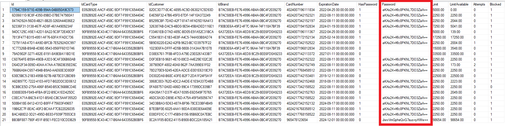

**Os cartões armazenados no banco de dados possuem senha 985471**

### Sobre o Docker
O banco de dados **Microsoft SQL Server** foi instalado dentro de um container Docker

Os procedimentos de instalação do Microsoft SQL Server dentro de um container Docker podem ser visualizadas aqui -> https://medium.com/@renato.groffe/net-sql-server-2017-parte-1-executando-o-sql-server-em-um-container-docker-83abbed8eb7e

Os dados utilizados para instalação:
1. Nome do servidor: localhost, 11433
2. Autenticação:		
	* Usuario: sa
	* Senha: DockerSql2017!
3. O scrit sql para geração dos objetos está aqui -> https://github.com/silvastefan/microtef-hire-me/blob/master/Desafio_Stone/KarnakCore/sql/GenerateDataBase.sql
4. O backup do banco de dados pode ser encontado aqui -> https://github.com/silvastefan/microtef-hire-me/blob/master/Desafio_Stone/KarnakCore/sql/KarnakStoneV13.bak

### Sobre o Microsoft SQL Server
Os dados são armazenados no banco de dados Microsoft SQL Server.

A estrutura do banco de dados:

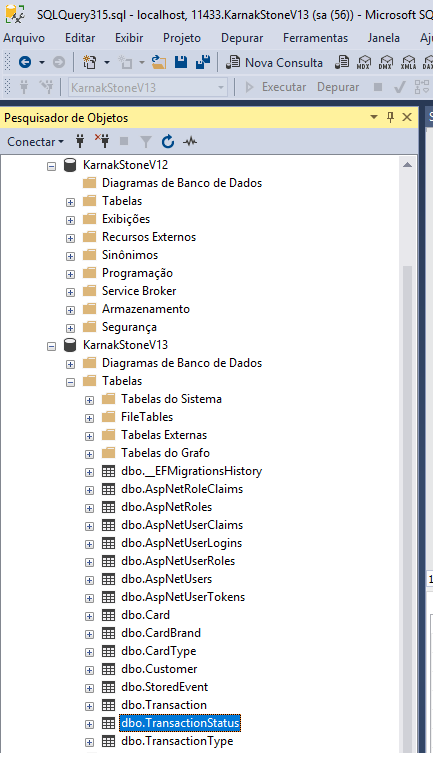

### Biblioteca de Terceiros
Para realizar a criptografia e descriptografia da senha foi utilizado a classe **StringCipher**.

### Mapemanento ORM
Para atender ao desafio proposto pela Stone foi estruturado um banco de dados com algumas tabelas básicas para a operação do sistema.

O sistema é composto por sete tabelas, abaixo suas estruturas e seus relacionamentos.

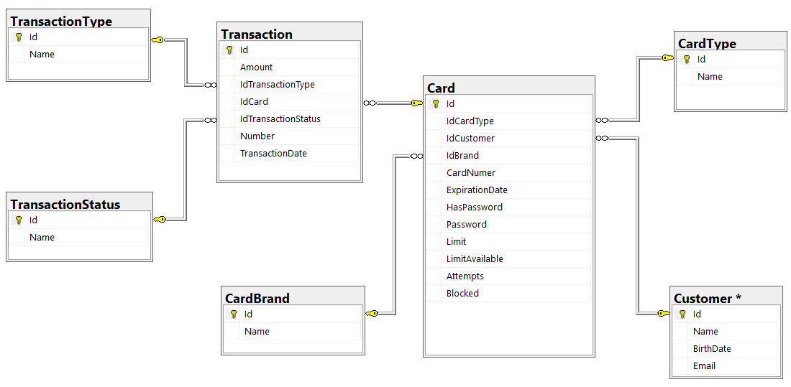
Banco de dados - Mapeamento ORM

### Possíveis Retornos do Servidor
1. Senha inválida
2. Cartão bloqueado
3. Mínimo de 10 centavos
4. Registro não encontrado
5. Senha Incorreta
6. Aprovado
7. Valor inválido
8. Transação aprovada
9. Saldo insuficiente
10. Senha entre 4 e 6 dítigos
11. Transação negada
12. Erro no tamanho da senha
13. Cartão vencido

### Sobre Event Sourcing
Por se tratar de um desafio, no qual são realizadas transações com cartões, visando uma maior segurança e rastreabilidade
optou-se por implmentar o **Event Sourcing**.

A finalidade do Event Sourcing é armazenar no banco de dados histórico de todas as operações recebidas ou enviadas 
pelo servidor de comunicações (Karnak).

### Funções Disponíveis por Tipo de Operação:
1. **Tipo Transação**
	* Incluir
	* Alterar
	* Excluir
	* Consultar
		* Por nome
		* Por id
	* Listagem
	* Historico
2. **Status Transação**
	* Incluir
	* Alterar
	* Excluir
	* Consultar
		* Por nome
		* Por id
	* Listagem
	* Historico
3. **Bandeira Cartão**
	* Incluir
	* Alterar
	* Excluir
	* Consultar
		* Por nome
		* Por id
	* Listagem
	* Historico
4. **Tipo Cartão**
	* Incluir
	* Alterar
	* Excluir
	* Consultar
		* Por nome
		* Por id
	* Listagem
	* Historico
5. **Clientes**
	* Incluir
	* Alterar
	* Excluir
	* Consultar
		* Por nome
		* Por id
	* Listagem
	* Historico
6. **Cartões**
	* Incluir
	* Alterar
	* Excluir
	* Consultar
		* Por nome
		* Por id
	* Listagem
	* Historico
7. **Transações**
	* Incluir
	* Consultar
		* Por id
	* Sondagem das transações efetuadas
	* Listagem somente das transações efetuadas
	* Listagem das transações com os relacionamentos de dados

### Para resolver o desafio foi necessário criar 4 projetos distintos:
1. **AmonRa** - cliente WPF
2. **EFCoreMapStone** - entity framework, cria o banco de dados, as tabelas, PK´s e FK´s
3. **UnitTesteKarnakStone** - responsável por realizar os testes unitários e de integração
4. **KarnakCore** - o coração do projeto, responsável por tudo, **é o cara!**

# 1 - O Projeto AmonRa - Cliente WPF
O nome AmonRa foi escolhido por se tratar do pai dos Deuses, o senhor da verdade, no antigo egito.

Para atender aos requisitos do desafio, foram criadas telas adicionais:

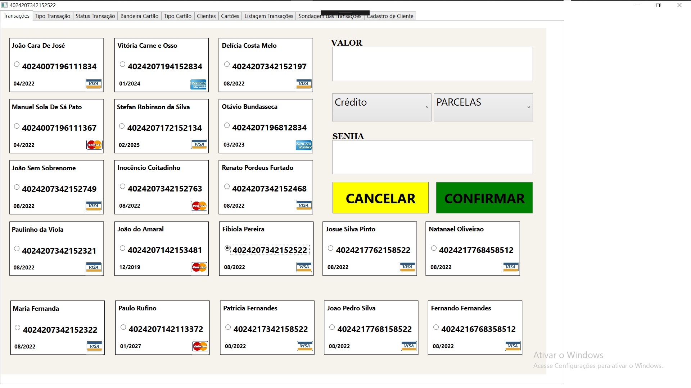
Cliente WPF - Tela Transações

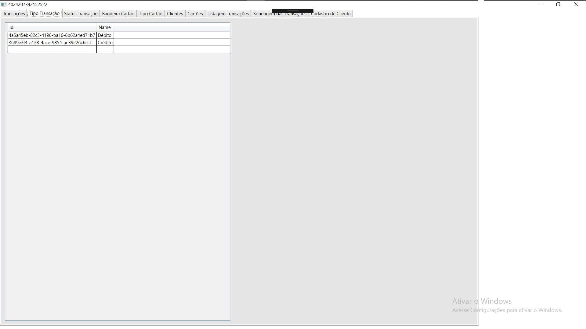
Cliente WPF - Tela Tipo Transações

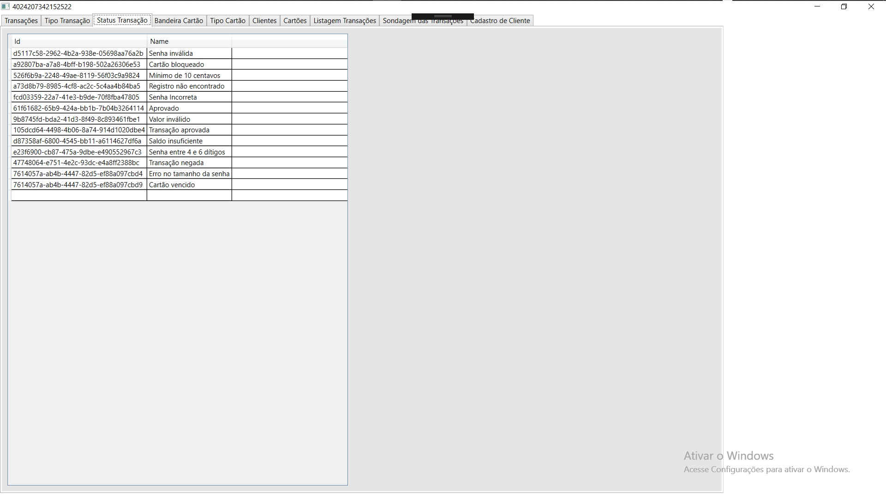
Cliente WPF - Tela Tipo Transações

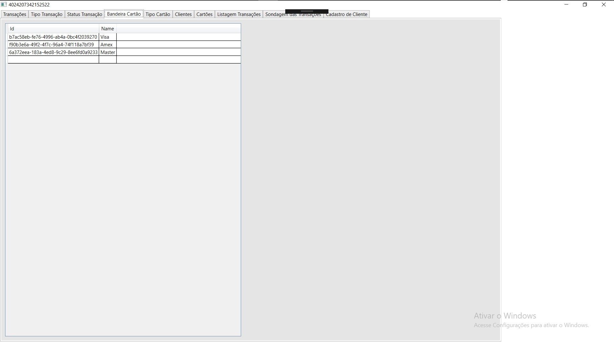
Cliente WPF - Tela Bandeira Cartao

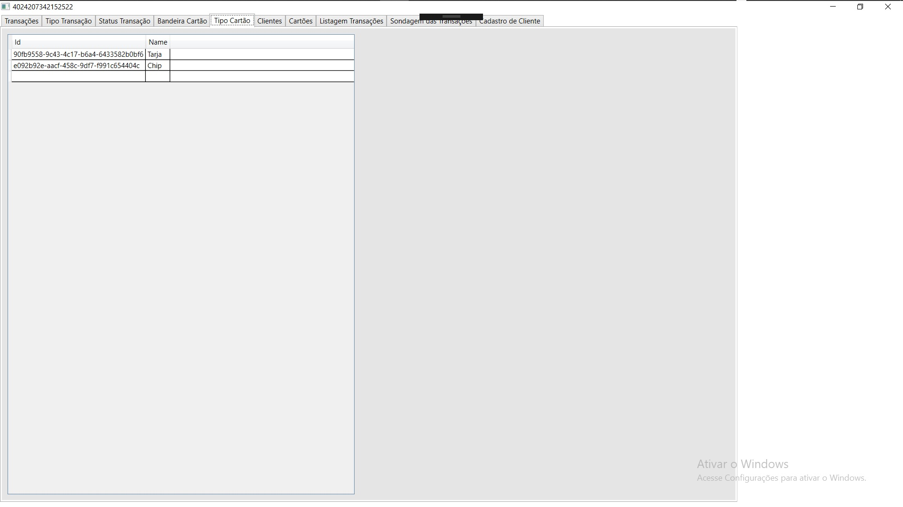
Cliente WPF - Tela Tipo Cartão

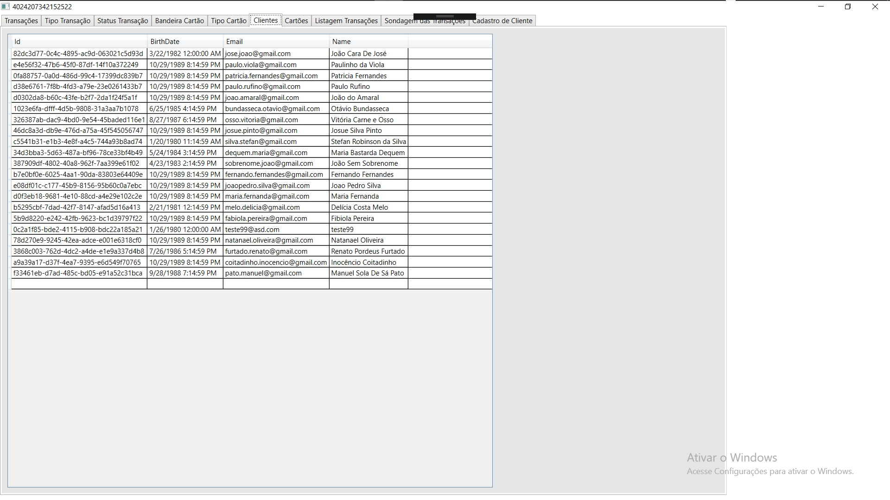
Cliente WPF - Tela Clientes

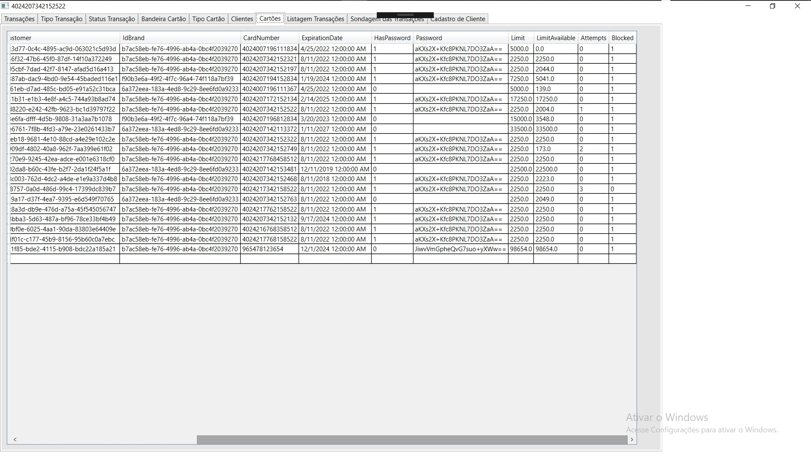
Cliente WPF - Tela Cartões

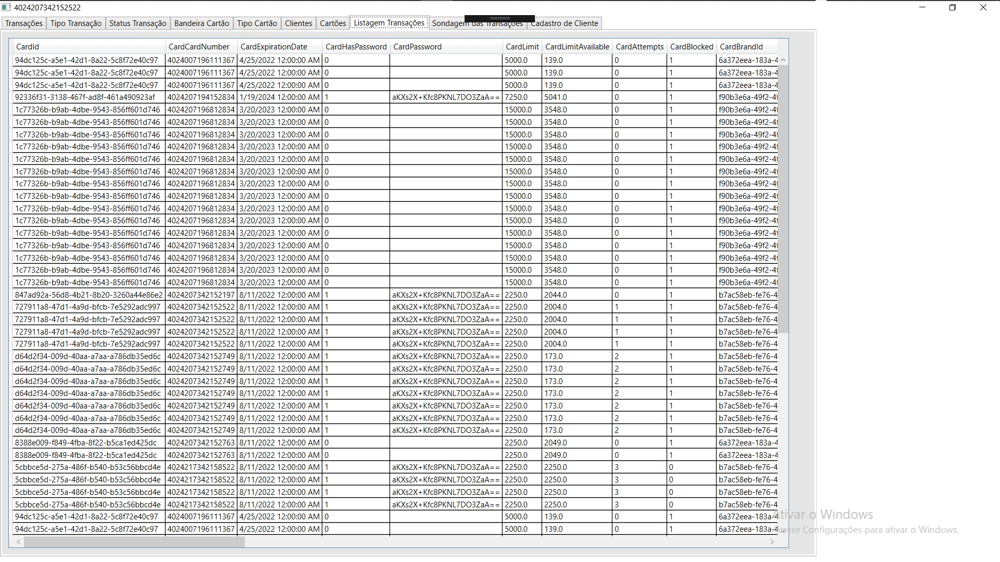
Cliente WPF - Tela Listagem Transacoes

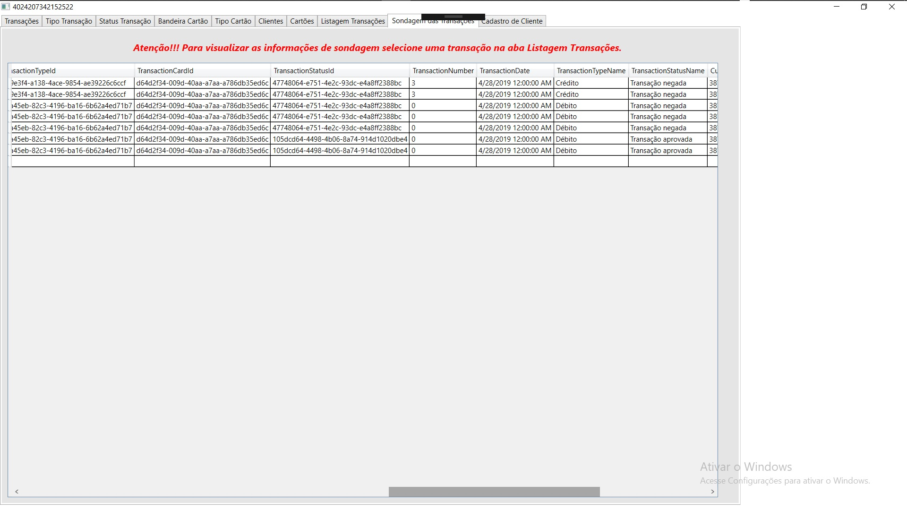
Cliente WPF - Tela Sondagem das Transacoes

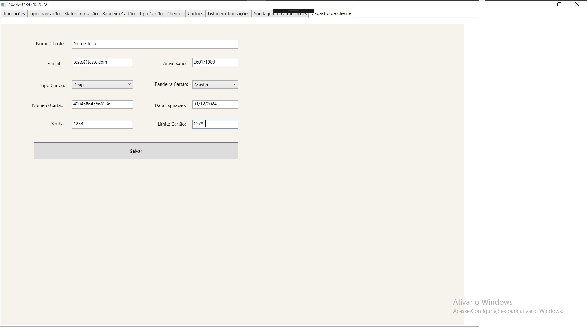
Cliente WPF - Tela Cadastro Cliente

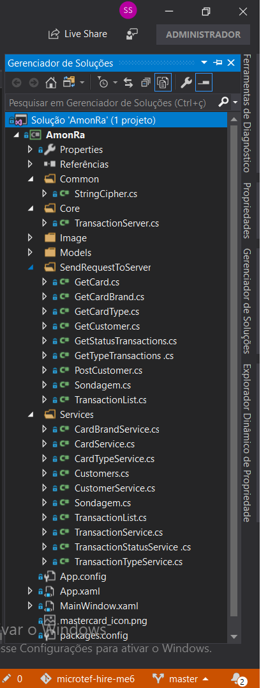

O projeto está estruturado da seguinte forma:
1. **Pasta Common**: classes comuns ao projeto
	* Classe StringCipher.cs: responsável por realizar a criptografia e descriptografia da senha
2. **Pasta Core**: responsável por efetuar transações
	* Classe TransactionServer.cs: enviar transações para o servidor Karnak  
3. **Pasta Models**: os modelos de dados		  
	* São as classes que ajudam na realização dos parser´s dos dados que são enviados para o servidor ou que chegam do mesmo
4. **Pasta SendRequestToServer**: enviar requisições para o servidor Karnak 
	* São as classes que realizam conexão diretamente com o api rest do servidor Karnak
5. **Pasta Services**: são os serviços que chamam as classes do passo 4
	* As telas WPF chamam as classes de serviços, que por sua vez chamam as classes do passo 4

### Catálogo de Cartões Virtuais
São os cartões cadastrados no banco de dados, as informações dos cartões são:
1. Número do cartão (cardnumber)
2. Senha do cartão (password), a senha será exigida somente para cartões com chip
3. Valor da transação (amount)
4. Tipo da transação (crédito ou débito)
5. Pacelas, quantidade de parcelas exibida somente para compras do tipo crédito
6. Validade do cartão
7. Bandeira do cartão (visa, master, amex)

### Sondagem das Transações
Para ver as transações realizads por algum cartão, é necessário escolher um cartão na tela da **Listagem Transações**.

### Listagem Transações
São todas as transações realizadas pelo servidor. 
É possível acompanhar o histórico das transações de um determinado cartão.
Todas as transações possuem status de **aprovada** ou **negada**.

### Realizando uma transação 
Passos para realizar uma transação:
1. Informar o valor
2. Escolher um cartão do catálogo
	* Se o cartão escolhido for do tipo **CHIP** o campo de senha **SERÁ** exibido
	* Se o cartão escolhido for do tipo **TARJA** o campo de senha **NÃO SERÁ** exibido
3. Escolher crédito ou débito
	* Se a opção escolhida for **CRÉDITO** a opção parcelamento **SERÁ** exibida
	* Se a opção escolhida for **DÉBITO** a opção parcelamento **NÃO SERÁ** exibida
4. Confirmar a transação pressionando o botão
	* Se ao pressionar o botão **CONFIRMAR** estiver faltando alguma informação obrigatória, um alerta será exibido
5. Pressionou o botão e todas as informações preenchidas
	* Será enviada para o servidor de comunicações (Karnak) uma requisição para realizar uma transação
	* O servidor irá validar as informações enviadas, caso ocorra alguma restrição, um ou mais erros podem ser retornados:
6. Diversas validações são realizadas pelo servidor de comunicações, caso alguma não seja satisfatória o mesmo irá retornar com erro. Os possíveis retornos podem ser vistos no item **Possíveis Retornos do Servidor**

### Cadastro de Cliente e Cartão
Passos para realizar o cadastro de um cliente e cartão
1. Informar o nome
2. Informar o e-mail
3. Informar data de aniversário
4. Escolher tipo do cartão
	* Se cartão escolhido for **CHIP** a opção para informar senha do cartão será exibida
5. Escolher a bandeira do cartão
6. Informar o número do cartão
7. Data de expiração do cartão
8. Limite do cartão
9. Pressionar Salvar
	* **Em caso de falha**
		* Todas as informações serão validatas, caso alguma não satisfaça alguma condição, um ou mais erros podem retornar
		* Validações diferentes são realizadas para cartão e cliente
		* Caso o servidor de comunicações retorne erro(s) os mesmos serão exibidos na tela
		* Diversas validações são realizadas pelo servidor de comunicações, caso alguma não seja satisfatória o mesmo irá retornar com erro. Os possíveis retornos podem ser vistos no item **Possíveis Retornos do Servidor**
	* **Em caso de sucesso**
		* Uma mensagem de **SUCESSO** será exibida para o cadastro do cliente e do cartão 

### App.config
O arquivo App.config possuí a **KEY** de configuração de conexão com o servidor de comunicações (Karnak).

Caso seja necessário realizar a troca da url, o arquivo está aqui -> https://github.com/silvastefan/microtef-hire-me/blob/master/Desafio_Stone/AmonRa/AmonRa/App.config

# 2 - Sobre o Entity Framework Core
Após criar as tabelas necessárias e realizar os devidos relacionamentos, configurar o arquivo KarnakContext.cs

Pesquisar no arquivo pelo termo "optionsBuilder.UseSqlServer" e realizar os ajustes necessários.

**Seguir os passos**:
1. dotnet ef migrations add mig1 -p EFCoreMapStoneV13
2. verificar se na lista de migracoes disponiveis esta a nova migracao 'mig1'
3. dotnet ef migrations list -p EFCoreMapStoneV13
4. Wooouuuu, tudo pronto! Agora vamos criar o banco de dados e as tabelas.
5. dotnet ef database -v update -v -p EFCoreMapStoneV13
6. se tudo correu bem, os scripts devem começar a serem exibidos

# 3 - Sobre os Testes Unitários
Testes unitários foram realizados em todas as api´s rest.

Abaixo a lista de todos os testes efetuados.

1. Bandeira Cartão
	* Post_CardBrand_The_Name_Is_Required
	* Delete_ByIdCardBrand_Valido
	* Get_ByNameCardBrand
	* Delete_ByIdCardBrand_Registro_nao_encontrado
	* Post_CardBrand_Valido
	* Put_CardBrand_The_Name_must_have_between_2_and_30_characters
	* Put_CardBrand_The_Guid_is_invalid_and_contains_00000000
	* Post_CardBrand_The_card_brand_id_has_already_been_taken_Run_2_Times
	* Post_CardBrand_The_Guid_is_empty
	* Put_CardBrand_Valido
	* Post_CardBrand_The_Guid_is_invalid_and_contains_00000000
	* Put_CardBrand_The_Name_is_Required
	* Post_CardBrand_The_card_brand_name_has_already_been_taken_Run
	* Delete_ByIdCardBrand_The_Guid_is_empty
	* Get_AllCardBrand
	* Put_CardBrand_The_card_brand_name_has_already_been_taken
	* Get_HistorycByIdCardBrand
	* Get_ByIdCardBrand
	* Put_CardBrand_The_Guid_is_empty
	* Post_CardBrand_The_Name_must_have_between_2_and_30_characters
	* Delete_ByIdCardBrand_The_Guid_is_invalid_and_contains_00000000
2. Tipo Cartão
	* Put_CardType_The_card_type_name_has_already_been_taken
	* Get_AllCardType
	* Post_CardType_Valido
	* Delete_ByIdCardType_The_Guid_is_invalid_and_contains_00000000
	* Delete_ByIdCardType_Registro_nao_encontrado
	* Post_CardType_The_card_type_id_has_already_been_taken_Run_2_Times
	* Get_HistorycByIdCardType
	* Post_CardType_The_Guid_is_empty
	* Post_CardType_The_Name_must_have_between_2_and_30_characters
	* Get_ByIdCardType
	* Put_CardType_The_Name_must_have_between_2_and_30_characters
	* Post_CardType_The_Name_Is_Required
	* Put_CardType_The_Name_is_Required
	* Put_CardType_Valido
	* Post_CardType_The_card_type_name_has_already_been_taken_Run
	* Get_ByNameCardType
	* Post_CardType_The_Guid_is_invalid_and_contains_00000000
	* Put_CardType_The_Guid_is_invalid_and_contains_00000000
	* Delete_ByIdCardType_The_Guid_is_empty
	* Delete_ByIdCardType_Valido
	* Put_CardType_The_Guid_is_empty
3. Cartão
	* Get_ByCardNumber
	* Get_HistorycByIdCard
	* Get_ByIdCard
	* Delete_ByIdCard_Valido
	* Post_Card_Valido
	* Get_AllCard
4. Cliente
	* Post_Customer_The_Name_must_have_between_2_and_30_characters
	* Post_Customer_Valido
	* Put_Customer_The_Name_must_have_between_2_and_100_characters
	* Put_Customer_Valido
	* Put_Customer_The_Guid_is_invalid_and_contains_00000000
	* Post_Customer_The_Guid_is_empty
	* Put_Customer_The_customer_name_has_already_been_taken
	* Post_Customer_The_customer_e_mail_has_already_been_taken_Run_2_Times
	* Put_Customer_The_Name_is_Required
	* Delete_ByIdCustomer_The_Guid_is_empty
	* Delete_ByIdCustomer_The_Guid_is_invalid_and_contains_00000000
	* Put_Customer_The_Guid_is_empty
	* Post_Customer_The_customer_id_has_already_been_taken_Run
	* Post_Customer_The_Name_Is_Required
	* Post_Customer_The_Guid_is_invalid_and_contains_00000000
	* Delete_ByIdCustomer_Valido
	* Delete_ByIdCustomer_Registro_nao_encontrado
	* Get_AllCustomer
	* Get_ByIdCustomer
	* Get_HistorycByIdCustomer
	* Get_ByNameCustomer
5. Senha
	* PasswordDecryptFail
	* PasswordDecryptSuccess
	* PasswordEncrypt
6. Transação Status
	* Get_ByIdTransactionStatus
	* Put_TransactionStatus_The_Guid_is_empty
	* Put_TransactionStatus_The_Name_must_have_between_2_and_30_characters
	* Delete_ByIdTransactionStatus_Valido
	* Delete_ByIdTransactionStatus_The_Guid_is_invalid_and_contains_00000000
	* Get_HistorycByIdTransactionStatus
	* Delete_ByIdTransactionStatus_Registro_nao_encontrado
	* Post_TransactionStatus_The_Name_must_have_between_2_and_30_characters
	* Post_TransactionStatus_The_Guid_is_invalid_and_contains_00000000
	* Get_AllTransactionStatus
	* Put_TransactionStatus_The_transaction_status_name_has_already_been_taken
	* Get_ByNameTransactionStatus
	* Put_TransactionStatus_Valido
	* Put_TransactionStatus_The_Name_is_Required
	* Post_TransactionStatus_The_transaction_status_id_has_already_been_taken_Run_2_Times
	* Post_TransactionStatus_The_Guid_is_empty
	* Post_TransactionStatus_Valido
	* Delete_ByIdTransactionStatus_The_Guid_is_empty
	* Put_TransactionStatus_The_Guid_is_invalid_and_contains_00000000
	* Post_TransactionStatus_The_Name_Is_Required
	* Post_TransactionStatus_The_transaction_status_name_has_already_been_taken
7. Transação Tipo
	* Post_TransactionType_The_Name_Is_Required
	* Delete_ByIdTransactionType_The_Guid_is_empty
	* Get_HistorycByIdTransactionType
	* Post_TransactionType_The_Guid_is_invalid_and_contains_00000000
	* Post_TransactionType_The_transaction_type_name_has_already_been_taken
	* Get_ByIdTransactionType
	* Post_TransactionType_The_Name_must_have_between_2_and_30_characters
	* Delete_ByIdTransactionType_Valido
	* Get_AllTransactionType
	* Put_TransactionType_The_Name_is_Required
	* Put_TransactionType_The_transaction_type_name_has_already_been_taken
	* Delete_ByIdTransactionType_The_Guid_is_invalid_and_contains_00000000
	* Get_ByNameTransactionType
	* Post_TransactionType_Valido
	* Put_TransactionType_The_Guid_is_empty
	* Put_TransactionType_The_Name_must_have_between_2_and_30_characters
	* Post_TransactionType_The_Guid_is_empty
	* Delete_ByIdTransactionType_Registro_nao_encontrado
	* Put_TransactionType_Valido
	* Put_TransactionType_The_Guid_is_invalid_and_contains_00000000
	* Post_TransactionType_The_transaction_type_id_has_already_been_taken_Run_2_Times
8. Transação
	* Post_Transaction_CHIP
	* Delete_ByIdTransaction_Valido
	* Post_Transaction_TARJA
	* Get_HistorycByIdTransaction
	* Get_ByIdTransaction
	* Post_Transaction_Cartao_Vencido
	* Get_AllTransaction
	* Get_ByNameTransaction

# 4 - Sobre o KarnakCore - Servidor de Comunicações

O servidor de comunicações é o projeto responsável por fazer tudo funcionar, **ele é o cara!**

Por que o nome **Karnak**:

Templo de Carnaque, ou simplesmente Carnaque, é um templo dedicado ao deus Amom-Rá. 

Tem esse nome devido a uma aldeia vizinha chamada Carnaque, mas no tempo dos antigos faraós a aldeia 
era conhecida como Ipet-sut.

Maiores informações sobre o templo de Karnak aqui -> https://www.penaestrada.blog.br/luxor-o-templo-de-karnak/

## Sobre CQRS
CQRS significa Command Query Responsibility Segregation. Como o nome já diz, é sobre separar a responsabilidade de escrita e leitura de seus dados.

CQRS é um pattern, um padrão arquitetural assim como Event Sourcing, Transaction Script e etc. 

O CQRS não é um estilo arquitetural como desenvolvimento em camadas, modelo client-server, REST e etc.

Atualmente as aplicações não são mais para atender dez usuários simultâneos, a maioria das novas aplicações nascem com
premisas de escalabilidade, performance e disponibilidade, fazer uma aplicação funcionar bem para cargas de trabalho 
de forma elástica é uma tarefa extremamente complexa.

O CQRS prega a divisão de responsabilidade de gravação e escrita de forma conceitual e física. 

Isto significa que além de ter meios separados para gravar e obter um dado os bancos de dados também são diferentes. 

As consultas são feitas de forma síncrona em uma base desnormalizada separada e as gravações de forma assíncrona em um banco normalizado.

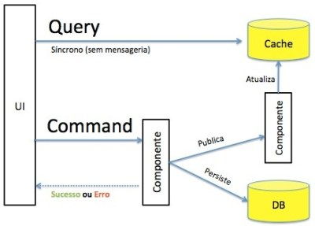

## Segregar as responsabilidades em QueryStack e CommandStack
A ideia básica é segregar as responsabilidades da aplicação em:

* Command
	* Operações que modificam o estado dos dados na aplicação.
* Query 
	* Operações que recuperam informações dos dados na aplicação.

**Para resolver o desafio foi utilizado uma arquitetura de N camadas, separarando as responsabilidades em CommandStack e QueryStack.**

## QueryStack
A QueryStack é uma camada síncrona que recupera os dados de um banco de leitura desnormalizado.

## CommandStack
O CommandStack por sua vez é potencialmente assíncrono. 

O CommandStack segue uma abordagem behavior-centric onde toda intenção de negócio é inicialmente disparada pela UI como um caso de uso. 

Utilizamos o conceito de Commands para representar uma intenção de negócio. 

Os Commands são declarados de forma imperativa (ex. Transaction) e são disparados assincronamente no formato de eventos, 
são interpretados pelos CommandHandlers e retornam um evento de sucesso ou falha.

Toda vez que um Command é disparado e altera o estado de uma entidade no banco de gravação um processo tem que ser disparado para 
os agentes que irão atualizar os dados necessários no banco de leitura.

## Arquitetura comparativa
A imagem do lado esquerdo representa uma aplicação padrão.

A imagem do lado direito representa uma aplicação CQRS.

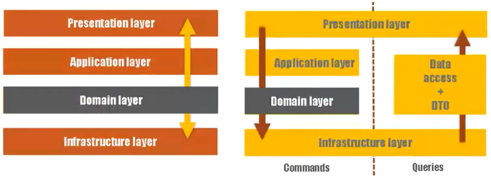

## Arquitetura utilizada na resolução do desafio Stone

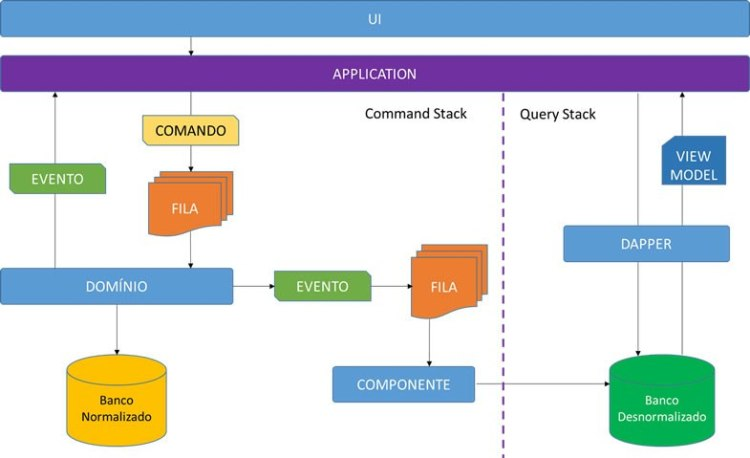

## Vantagens de utilizar CQRS
A implementação do CQRS quebra o conceito monolítico clássico de uma implementação de arquitetura em N camadas onde todo o processo 
de escrita e leitura passa pelas mesma camadas e concorre entre si no processamento de regras de negócio e uso de banco de dados.

Este tipo de abordagem aumenta a disponibilidade e escalabilidade da aplicação e a melhoria na performance surge principalmente pelos aspectos:

* Todos comandos são assíncronos e processados em fila, assim diminui-se o tempo de espera.

* Os processos que envolvem regras de negócio existem apenas no sentido da inclusão ou alteração do estado das informações.

* As consultas na QueryStack são feitas de forma separada e independente e não dependem do processamento da CommandStack.

* É possível escalar separadamente os processos da CommandStack e da QueryStack.
 
Uma outra vantagem de utilizar o CQRS é que toda representação do seu domínio será mais expressiva e reforçará a utilização da linguagem ubíqua 
nas intenções de negócio.

Toda a implementação do CQRS pattern pode ser feito manualmente, sendo necessário escrever diversos tipos de classes para cada aspecto, porém 
é possível encontrar alguns frameworks de CQRS que vão facilitar um pouco a implementação e reduzir o tempo de codificação.

## Arquitetura Sugerida
Abaixo arquitetura sugerida para resolução do desafio de uma forma mais escalável. 

Essa arquitetura trabalha diretamente com microserviços, fila e event-driven.

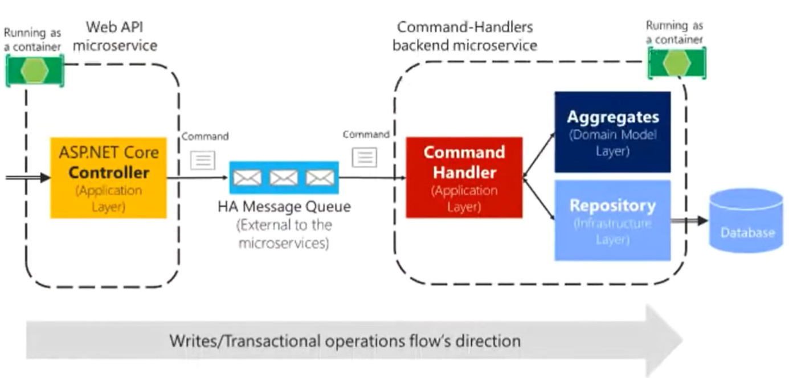

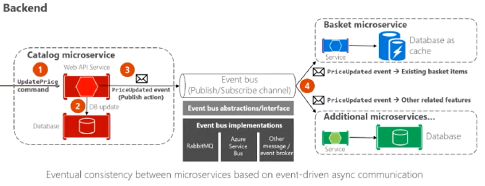

## Swagger
Todas as api´s rest podem ser utilizadas com Swagger ou através do projeto de testes unitários.

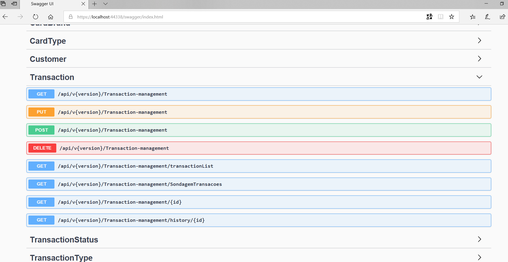

## Gerar Banco de Dados
* Executar script -> https://github.com/silvastefan/microtef-hire-me/blob/master/Desafio_Stone/KarnakCore/sql/GenerateDataBase.sql

